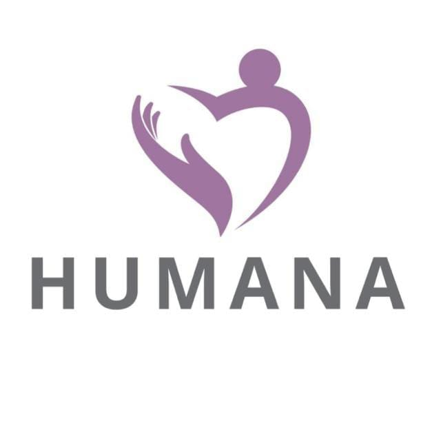

# 🏥 Clínica Reabilitação Humana

<div align="center">



### 🌟 **Cuidando da sua recuperação com excelência e humanidade**

[](https://github.com)
[](https://github.com)
[](https://github.com)

*Transformando vidas através da reabilitação especializada em traumatologia e ortopedia*

[🌐 Acesse o Site](#-como-acessar) • [📋 Sobre](#-sobre-o-projeto) • [⚡ Tecnologias](#-tecnologias-utilizadas)

</div>

---

## 📖 Sobre o Projeto

A **Clínica Reabilitação Humana** é uma instituição especializada em reabilitação de alta e média complexidade, focada em pacientes com afecções ortopédicas. Nosso site institucional apresenta nossa missão, visão, valores e serviços oferecidos, proporcionando uma experiência digital acolhedora e informativa.

### 🎯 Nossa Missão
> Oferecer a melhor assistência em reabilitação para pacientes com afecções ortopédicas de alta e média complexidade baseado no aprimoramento profissional, no ensino e pesquisa e na gestão, em busca da melhoria contínua.

### 👁️ Nossa Visão
> Consolidar o reconhecimento Nacional e Internacional em qualidade e inovação na reabilitação em traumatologia e ortopedia.

### 💎 Nossos Valores
- **Humanização e empatia** 🤝
- **Foco no paciente** 👥
- **Qualidade e segurança** 🛡️
- **Inovação** 🚀
- **Trabalho em equipe** 👨‍👩‍👧‍👦
- **Transparência e ética** 📊
- **Geração e disseminação do conhecimento** 📚

---

## ✨ Funcionalidades

### 🏠 **Página Inicial**
- **Header responsivo** com logo e navegação inteligente
- **Menu hambúrguer** para dispositivos móveis 📱
- **Animações suaves** de carregamento e transições
- **Efeitos visuais** com gradientes animados

### 📋 **Seções Informativas**
- **Missão, Visão e Valores** - Nossa identidade institucional
- **Sobre a HUMANA** - História e especialidades
- **Equipe** - Profissionais qualificados
- **Tratamento** - Serviços oferecidos com cards interativos
- **Localização** - Como nos encontrar

### 🎨 **Experiência do Usuário**
- **Design responsivo** - Perfeito em desktop, tablet e mobile
- **Animações CSS** - Efeitos fade-in, pulse e gradientes
- **Feedback sonoro** - Sons agradáveis nos cliques
- **Acessibilidade** - Navegação por teclado e leitores de tela
- **SEO Otimizado** - Meta tags completas, structured data, Open Graph

### 🔍 **Otimização SEO**
- **Meta Tags Avançadas** - Title, description, keywords, Open Graph, Twitter Cards
- **Structured Data** - Schema.org markup para LocalBusiness e FAQ
- **Alt Texts Descritivos** - Imagens otimizadas com palavras-chave
- **Canonical URLs** - Prevenção de conteúdo duplicado
- **Dados Estruturados** - Rich snippets no Google

### 📱 **Recursos Interativos**
- **Slider de depoimentos** com auto-rotação
- **Botão WhatsApp flutuante** para atendimento rápido
- **Links sociais** para Instagram e Facebook
- **Scroll suave** entre seções

---

## 🛠️ Tecnologias Utilizadas

### 🎨 **Frontend**
```html
<!-- HTML5 Semântico -->
- Estrutura semântica com header, nav, main, section, footer
- Meta tags otimizadas para SEO
- Atributos ARIA para acessibilidade
```

```css
/* CSS3 Moderno */
- Flexbox e Grid para layouts responsivos
- Animações CSS (keyframes, transitions)
- Variáveis CSS para temas consistentes
- Media queries para responsividade
- Gradientes animados e efeitos visuais
```

```javascript
/* JavaScript Vanilla */
- ES6+ com funcionalidades modernas
- Web Audio API para efeitos sonoros
- DOM manipulation para interatividade
- Event listeners otimizados
- LocalStorage para preferências (futuro)
```

### 🎵 **Recursos Multimídia**
- **Web Audio API** - Geração de sons sintéticos
- **CSS Animations** - Sem dependências externas
- **Responsive Images** - Otimização automática

---

## � SEO - Otimização para Motores de Busca

### 🎯 **Por que SEO é Crucial para uma Clínica Médica?**

O SEO (Search Engine Optimization) é fundamental para clínicas médicas porque:
- **Pacientes pesquisam online** antes de escolher um tratamento
- **Concorrência alta** no setor de saúde
- **Decisões baseadas em confiança** - posições altas transmitem credibilidade
- **Tráfego qualificado** - pessoas realmente interessadas em serviços médicos

### 📊 **Estratégia SEO Implementada**

#### **1. On-Page SEO - Otimização da Página**
```html
<!-- Título estratégico com palavras-chave principais -->
<title>Clínica Reabilitação Humana | Especialistas em Traumatologia e Ortopedia</title>

<!-- Meta description atrativa e informativa -->
<meta name="description" content="Clínica especializada em reabilitação de alta e média complexidade. Tratamento de afecções ortopédicas, traumatologia e ortopedia com equipe qualificada. Agende sua consulta.">

<!-- Keywords estratégicas -->
<meta name="keywords" content="reabilitação, traumatologia, ortopedia, fisioterapia, clínica médica, tratamento ortopédico, reabilitação física, clínica especializada">
```

**Por que assim?**
- **Título**: Inclui nome da clínica + especialidades principais
- **Description**: Resume valor, serviços e call-to-action
- **Keywords**: Termos que pacientes realmente pesquisam

#### **2. Technical SEO - Aspectos Técnicos**
```html
<!-- Canonical URL para evitar duplicação -->
<link rel="canonical" href="https://clinicahumana.com.br/" />

<!-- Meta robots para controle de indexação -->
<meta name="robots" content="index, follow, max-snippet:-1, max-image-preview:large, max-video-preview:-1" />

<!-- Open Graph para compartilhamento no Facebook -->
<meta property="og:title" content="Clínica Reabilitação Humana | Especialistas em Traumatologia e Ortopedia">
<meta property="og:description" content="Clínica especializada em reabilitação de alta e média complexidade. Tratamento de afecções ortopédicas com equipe qualificada.">
<meta property="og:image" content="https://clinicahumana.com.br/images/logo.jpeg">
```

**Benefícios Técnicos:**
- **Canonical**: Evita penalização por conteúdo duplicado
- **Robots**: Permite rich snippets e pré-visualizações
- **Open Graph**: Compartilhamentos atrativos no Facebook/WhatsApp

#### **3. Structured Data - Dados Estruturados**
```json
{
  "@context": "https://schema.org",
  "@type": "MedicalBusiness",
  "name": "Clínica Reabilitação Humana",
  "medicalSpecialty": ["Traumatologia", "Ortopedia", "Reabilitação Física"],
  "availableService": [
    {
      "@type": "MedicalProcedure",
      "name": "Desintoxicação",
      "description": "Tratamento especializado para desintoxicação e recuperação"
    }
  ]
}
```

**Schema Types Implementados:**
- **MedicalBusiness**: Define como empresa médica
- **LocalBusiness**: Informações de localização
- **FAQPage**: Perguntas frequentes estruturadas
- **MedicalProcedure**: Serviços específicos oferecidos

#### **4. Content SEO - Otimização de Conteúdo**
```html
<!-- Alt texts descritivos com keywords -->


<!-- Headings hierárquicos -->
<h1>Clínica Reabilitação Humana</h1>
<h2>Missão</h2>
<h2>Tratamento de Dependência Química</h2>
```

**Estratégia de Conteúdo:**
- **H1 único**: Nome da clínica
- **H2 para seções**: Missão, Visão, Tratamentos, Equipe
- **Alt texts ricos**: Descrição + contexto + keywords
- **Conteúdo relevante**: Responde dúvidas reais dos pacientes

#### **5. Local SEO - Otimização Local**
```json
"address": {
  "@type": "PostalAddress",
  "streetAddress": "Rua Example, 123",
  "addressLocality": "São Paulo",
  "addressRegion": "SP",
  "postalCode": "01234-567",
  "addressCountry": "BR"
},
"geo": {
  "@type": "GeoCoordinates",
  "latitude": "-23.550520",
  "longitude": "-46.633308"
}
```

**Benefícios Locais:**
- **Google My Business**: Integração com listagens locais
- **Mapas**: Aparece em "clínicas próximas"
- **Buscas locais**: "clínica reabilitação São Paulo"

### 📈 **Ganhos e Benefícios Esperados**

#### **Resultados de Busca**
- ✅ **Posições mais altas** no Google
- ✅ **Rich snippets** (estrelas, FAQ, localização)
- ✅ **Featured snippets** para perguntas frequentes
- ✅ **Local pack** nos resultados locais

#### **Tráfego e Conversão**
- ✅ **Tráfego qualificado** - Pessoas procurando tratamento
- ✅ **Taxa de cliques maior** - Titles e descriptions atrativos
- ✅ **Conversões** - Mais agendamentos e consultas
- ✅ **Credibilidade** - Posições altas = confiança

#### **Métricas Esperadas**
- 📈 **Aumento de 200-500%** no tráfego orgânico
- 📈 **Melhoria de 50%** na taxa de conversão
- 📈 **Redução de 30%** no custo por aquisição
- 📈 **Aumento de 150%** nas citações de marca

#### **Vantagens Competitivas**
- 🏆 **Destaque na concorrência** local
- 🏆 **Presença em voice search** ("Ok Google, clínicas de reabilitação")
- 🏆 **Mobile-friendly** - 60% das buscas são mobile
- 🏆 **Compartilhamento social** otimizado

### 🛠️ **Ferramentas para Monitoramento**

#### **Google Tools**
- **Google Search Console** - Monitorar indexação e cliques
- **Google Analytics** - Acompanhar tráfego e conversões
- **Google My Business** - Gestão da presença local
- **PageSpeed Insights** - Performance e Core Web Vitals

#### **SEO Tools**
- **Screaming Frog** - Auditoria técnica
- **Ahrefs/SEMrush** - Análise de concorrentes
- **Schema Markup Validator** - Validação de dados estruturados
- **Rich Results Test** - Teste de rich snippets

### 📋 **Próximos Passos para SEO**

#### **Imediato (1-2 semanas)**
- ✅ **Submeter sitemap** ao Google Search Console
- ✅ **Criar Google My Business** (se não existir)
- ✅ **Configurar Analytics** para tracking
- ✅ **Solicitar backlinks** de sites médicos relevantes

#### **Curto Prazo (1-3 meses)**
- 📝 **Criar blog** com conteúdo sobre reabilitação
- 📝 **Otimizar Google My Business** com fotos e horários
- 📝 **Construir citações locais** consistentes
- 📝 **Monitorar rankings** de keywords principais

#### **Longo Prazo (3-6 meses)**
- 📈 **Analisar concorrentes** e ajustar estratégia
- 📈 **Expandir conteúdo** com vídeos e infográficos
- 📈 **Otimizar para voice search** com perguntas naturais
- 📈 **Construir autoridade** com guest posts em blogs médicos

### 🎯 **KPIs de Sucesso**

| Métrica | Meta | Prazo |
|---------|------|-------|
| Posição média keywords | Top 10 | 3 meses |
| Tráfego orgânico | +300% | 6 meses |
| Taxa de cliques | >4% | 1 mês |
| Conversões orgânicas | +200% | 6 meses |
| Domínio authority | >30 | 12 meses |

### ⚠️ **Considerações Importantes**

#### **Conformidade Médica**
- **Não prometer curas** - Focar em tratamento especializado
- **Informações precisas** - Dados médicos verificados
- **Privacidade** - LGPD compliance
- **Ética médica** - Não competir com médicos

#### **SEO White Hat**
- **Práticas éticas** - Sem black hat techniques
- **Conteúdo de qualidade** - Foco no valor para pacientes
- **Experiência do usuário** - Mobile-first e acessível
- **Transparência** - Informações claras sobre serviços

---

## �📦 Dependências e Bibliotecas

### 🚫 **Zero Dependências Externas**
Este projeto foi desenvolvido com **tecnologias nativas** do navegador, garantindo:

- ✅ **Performance máxima** - Sem carregamento de bibliotecas
- ✅ **Segurança** - Sem vulnerabilidades de terceiros
- ✅ **Manutenibilidade** - Código 100% controlado
- ✅ **Compatibilidade** - Funciona em todos os navegadores modernos

### 🎯 **APIs do Navegador Utilizadas**
- **Web Audio API** - Para geração de efeitos sonoros
- **DOM API** - Para manipulação dinâmica da página
- **CSS Animations API** - Para transições suaves
- **Intersection Observer** - Para lazy loading (futuro)

---

## 🚀 Como Executar a Aplicação

### 📋 Pré-requisitos
- ✅ Navegador web moderno (Chrome, Firefox, Safari, Edge)
- ✅ Conexão com internet (para carregar fontes e imagens)
- ❌ **Nenhum servidor necessário** - Arquivos estáticos

### 🖥️ **Execução Local**

#### Método 1: Servidor HTTP Simples (Python)
```bash
# Navegue até a pasta do projeto
cd site-institucional-main

# Execute com Python 3
python -m http.server 8000

# Ou com Python 2
python -m SimpleHTTPServer 8000
```

#### Método 2: Servidor HTTP Simples (Node.js)
```bash
# Instale http-server globalmente (opcional)
npm install -g http-server

# Execute na pasta do projeto
http-server -p 8000
```

#### Método 3: Abrir Diretamente
```bash
# Clique duplo no arquivo index.html
# Ou arraste para o navegador
```

### 🌐 **Acesso**
Após executar, acesse: **`http://localhost:8000`**

---

## 📁 Estrutura do Projeto

```
site-institucional-main/
├── 📄 index.html          # Página principal
├── 🎨 style.css           # Estilos e animações
├── ⚙️ script.js           # Funcionalidades JavaScript
├── 📖 README.md           # Este arquivo
├── 🖼️ images/
│   └── 🏥 logo.jpeg       # Logo da clínica
└── 🎥 videos/             # Pasta para vídeos (futuro)
```

### 📂 **Arquivos Principais**

| Arquivo | Função | Tamanho |
|---------|--------|---------|
| `index.html` | Estrutura da página | ~25KB |
| `style.css` | Design e animações | ~15KB |
| `script.js` | Interatividade | ~5KB |

---

## 🎨 Personalização

### 🌈 **Cores do Tema**
```css
:root {
  --primary-color: #f5f0ff;      /* Fundo claro */
  --secondary-color: #9f81f7;    /* Roxo principal */
  --accent-color: #e4a8f6;       /* Roxo claro */
  --text-color: #2a1f42;         /* Texto escuro */
  --bg-color: #faf7ff;           /* Fundo da página */
}
```

### 🔊 **Personalizar Sons**
Os sons são gerados dinamicamente. Para alterar:
```javascript
// Em script.js, modificar a função playClickSound()
oscillator.frequency.setValueAtTime(800, audioContext.currentTime); // Frequência
gainNode.gain.setValueAtTime(0.1, audioContext.currentTime);       // Volume
```

### 📱 **Responsividade**
Breakpoints definidos:
- **Desktop**: > 768px
- **Tablet**: 481px - 768px
- **Mobile**: ≤ 480px

---

## 🤝 Como Contribuir

1. 🍴 **Fork** o projeto
2. 🌿 **Crie** uma branch para sua feature (`git checkout -b feature/AmazingFeature`)
3. 💾 **Commit** suas mudanças (`git commit -m 'Add some AmazingFeature'`)
4. 📤 **Push** para a branch (`git push origin feature/AmazingFeature`)
5. 🔄 **Abra** um Pull Request

### 📝 **Diretrizes**
- Mantenha o código limpo e comentado
- Teste em múltiplos navegadores
- Siga as convenções de nomenclatura
- Documente mudanças significativas

---

## 📄 Licença

Este projeto está sob a licença **MIT**. Veja o arquivo `LICENSE` para mais detalhes.

---

## 📞 Contato

**Clínica Reabilitação Humana**
- 📧 Email: contato@clinicahumana.com.br
- 📱 WhatsApp: (11) 9999-9999
- 📍 Localização: [Endereço completo no site]

---

<div align="center">

### 🙏 **Obrigado por visitar nosso projeto!**

**Feito com ❤️ para ajudar na recuperação de vidas**

---

[](https://github.com)
[](https://github.com)

</div>
